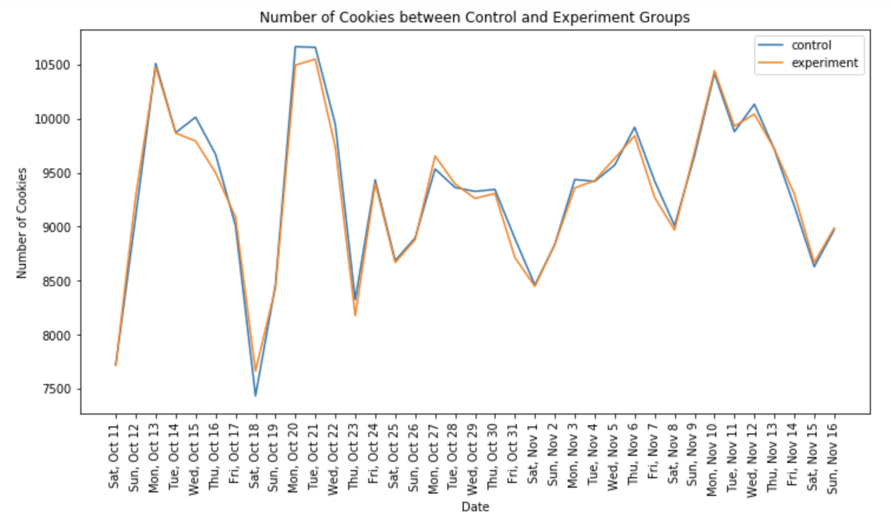
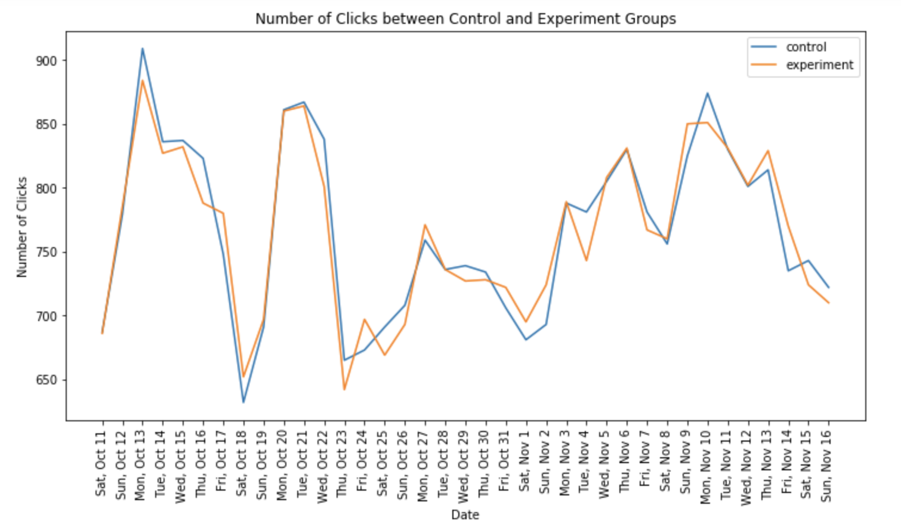
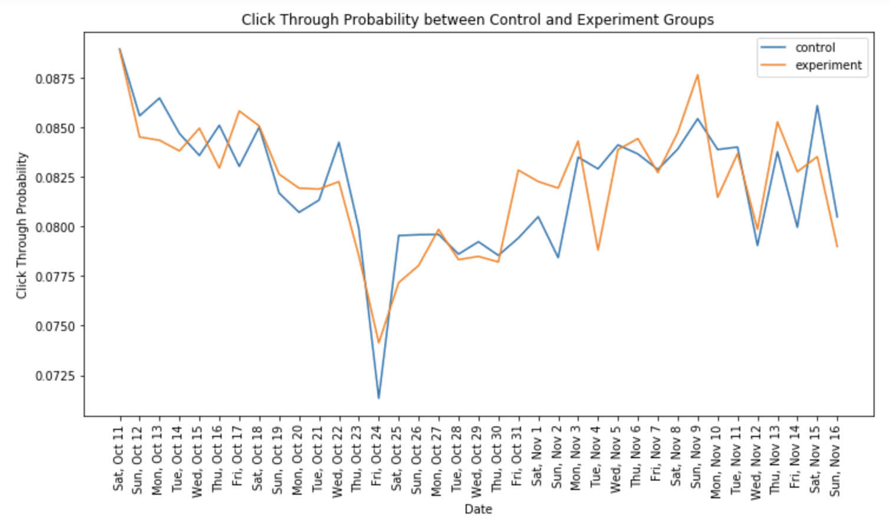

# AB-Testing-Project
## Experiment Overview: Free Trial Screener  

At the time of this experiment, Udacity courses currently have two options on the course overview page: "start free trial", and "access course materials". If the student clicks "start free trial", they will be asked to enter their credit card information, and then they will be enrolled in a free trial for the paid version of the course. After 14 days, they will automatically be charged unless they cancel first. If the student clicks "access course materials", they will be able to view the videos and take the quizzes for free, but they will not receive coaching support or a verified certificate, and they will not submit their final project for feedback.

In the experiment, Udacity tested a change where if the student clicked "start free trial", they were asked how much time they had available to devote to the course. If the student indicated 5 or more hours per week, they would be taken through the checkout process as usual. If they indicated fewer than 5 hours per week, a message would appear indicating that Udacity courses usually require a greater time commitment for successful completion, and suggesting that the student might like to access the course materials for free. At this point, the student would have the option to continue enrolling in the free trial, or access the course materials for free instead. This screenshot shows what the experiment looks like.

## 1. Experiment Design
### 1.1 Unit of Diversion (provided by Udacity)
The unit of diversion is a **cookie**, although if the student enrolls in the free trial, they are tracked by user-id from that point forward. The same user-id cannot enroll in the free trial twice. For users that do not enroll, their user-id is not tracked in the experiment, even if they were signed in when they visited the course overview page.

### 1.2 Initial Hypothesis 
The hypothesis was that this might set clearer expectations for students upfront, thus **reducing the number of frustrated students who left the free trial** because they didn't have enough time—without significantly reducing the number of students to continue past the free trial and eventually complete the course. If this hypothesis held true, Udacity could improve the overall student experience and improve coaches' capacity to support students who are likely to complete the course. (Provided by Udacity)  
  
Based on the information above, we can set some initial hypotheis: (these are just initial hypothesis and we will revise them further)

  1. H0: the change has no effect on the number of students who enroll the free trial.  
     H1: the change reduces the number of students who enroll the free trial.
   
   
  2. H0: the change has no effect on the number of students who leave the free trial.  
     H1: the change reduces the number of students who leave the free trial.  
    
    
  3. H0: the change has no effect on the probability of students who continue the free trial after 14 days.  
     H1: the change increases the probability of students who continue the free trial after 14 days.  
     (since we cannot say the number will be increased or decreased here, we use probability.)
     
### 1.3 Metric Choice
there are seven choices from Udacity below.

- **Number of cookies**: That is, number of unique cookies to view the course overview page. (dmin=3000)
- **Number of user-ids**: That is, number of users who enroll in the free trial. (dmin=50)
- **Number of clicks**: That is, number of unique cookies to click the "Start free trial" button (which happens before the free trial screener is trigger). (dmin=240)
- **Click-through-probability**: That is, number of unique cookies to click the "Start free trial" button divided by number of unique cookies to view the course overview page. (dmin=0.01)
- **Gross conversion**: That is, number of user-ids to complete checkout and enroll in the free trial divided by number of unique cookies to click the "Start free trial" button. (dmin= 0.01)
- **Retention**: That is, number of user-ids to remain enrolled past the 14-day boundary (and thus make at least one payment) divided by number of user-ids to complete checkout. (dmin=0.01)
- **Net conversion**: That is, number of user-ids to remain enrolled past the 14-day boundary (and thus make at least one payment) divided by the number of unique cookies to click the "Start free trial" button. (dmin= 0.0075)  

dmin means the practical significance boundary for each metric, that is, the difference that would have to be observed before that was a meaningful change for the business, is given in parentheses. All practical significance boundaries are given as absolute changes.

#### 1.3.1 Choosing Invariant Metrics
The invariant metrics (control variables) are metrics that we expect not to change between experiment and control group. And they will be used for sanity check

Based on the metrics above, we would like to treat these three as invariant metrics: 
- **Number of cookies**
- **Number of clicks**
- **Click-through-probability**: Number of clicks / Number of cookies

Because these are the data that we can collect before the change, so they must nearly be same in both test and control group. And these three are all dependent on cookies, which is the unit of diversion for this project.  
Also, for the click through probability, though it covers both number of cookies and number of clicks, it might be unexpected vary during sanity check, so it is much safer to track those three.

#### 1.3.2 Choosing Evaluation Metrics
For evaluation indicators, we should not only care the statistical significance, but also whether the change of the metric is significant in practice (dmin), because the treatment may not be worth implementing (although there is statistical significance).  
    

We consider these three metrics below can be used for our A/B testing project.
- **Gross conversion**: we expect this metric will be decreased in treatment group. (users get the question and will have a second to consider enroll or not, this will filter some users who are not willing to checkout after free trial period).  

- **Retention**: we expect this metric will be increased in treatment group. (since the question has already filtered some uses who are not willing to checkout after free trial period, the retention rate should get higher).  

- **Net conversion**: since it is the product of the two above, we cannot expect its direction, which may vary.   
  
  
  
- **Attention:** 
  **Number of user-ids**: for this metric, we won't use it because:
    - User-ids are tracked only after enrolling in the free trial, so we cannot expect the equal distribution between the control and experimental group. It isn't normalized.
    - Also, the information about number of user-ids can be inculded in the gross conversion. 

#### 1.3.3 Hypothesis Revised
Based on the metrics we choose and the initial hypothesis, we can revise our hypothesis.

 1. H0: Gross Conversion(control) = Gross Conversion(treatment)  
    H1: Gross Conversion(control) != Gross Conversion(treatment)
 2. H0: Retention(control) = Retention(treatment)  
    H1: Retention(control) != Retention(treatment)
 3. H0: Net Conversion(control) = Net Conversion(treatment)  
    H1: Net Conversion(control) != Net Conversion(treatment)
    
## 2. Measuring Standard Deviation  

In binomial distribution, the standard deviation = sqrt(p(1-p)/n)

**Standard Deviation for Evaluation Metrics**
| Evaluation Metrics	      | Standard Deviation     | 
| ---------- | :-----------:  | 
| Gross Conversion	     | .0202    | 
| Retention     | .0549    | 
| Net Conversion     | .0156     | 

## 3. Sizing
We set the alpha to be 0.05 and the statistical power to be 0.80 (i.e. beta is 0.20).
And we used an online calculator and the results are as follows.

**Sizing for Each Evaluation Metrics**
| Evaluation Metrics	      | Sample Size     | 
| ---------- | :-----------:  | 
| Gross Conversion	     | 645,875    | 
| Retention     | 4,741,212    | 
| Net Conversion     | 685,325     | 

Given the calculation above, to test these three hypothesis, we need 4,741,212 pageviews.

### 3.0.1 multiple hypothesis?
As we now have three hypothesis, and these three hypothesis are not fully independent. So the false positive rate is likely to be increased. We can solve the multiple hypothesis problem by Bonferroni Correction method, but it still has backward that it will increase the fale negatives. Therefore, we prefer not to solving this problem.

## 3.1 Choosing Duration vs. Exposure
From the Udacity, given there are 40k pageviews per day, we can first assume we can use 100% of users for this experiment.
However, we've calculated that: 
- for the experiment with gross conversion, retention and net conversion, we need:  119  days
- for the experiment with gross conversion and net conversion, we need:  17  days

We can see there is a huge difference in experiment duration between using and discarding retention. Therefore, we decide to remove the retention metric for this experiment. Because firstly, using the retention metric will take a long time to conduct this experiment, which will cause opportunity costs(eg. launch more different experiments, spend more time on other feature improvements). Moreover, there will be some business risks that exist if we use the retention metric. For instance, this change will give a worse user experiment decreasing the conversion rate.

Also, for the experiment with gross conversion and net conversion, we should reconsider the fraction of Udacity's traffic to be diverted. Considering there might be some seasonal effect for this experiment, 17 days seems not enough for us to certain. Secondly, using full traffic is very costly and risky (opportunity cost & business risk we mentioned above). Diverting a half or lower of traffic will be much safer.

- for the experiment using 50% traffic with gross conversion and net conversion, we need:  34  days
- for the experiment using 45% traffic with gross conversion and net conversion, we need:  38  days

It seems that 38 days are little bit longer, so we will divert 50% traffic for the experiment with gross conversion and net conversion.

## 4. Experiment Analysis
Now, we have two datasets from Udacity, one for control group and one for experiment group.

The meaning of each column is:

- Pageviews: Number of unique cookies to view the course overview page that day.
- Clicks: Number of unique cookies to click the course overview page that day.
- Enrollments: Number of user-ids to enroll in the free trial that day.
- Payments: Number of user-ids who who enrolled on that day to remain enrolled for 14 days and thus make a payment. (Note that the date for this column is the start date, that is, the date of enrollment, rather than the date of the payment. The payment happened 14 days later. Because of this, the enrollments and payments are tracked for 14 fewer days than the other columns.)

### 4.1 Sanity Check
#### 4.1.1 visualization
We can make some visualizations to make a clear comparison between control and experiment groups on invariant metrics.

Here we also found there is a dramatically drop on click through rate on Oct. 24th. It's worthwhile to find the potential reason and effects.

#### 4.1.2 sanity checks

First, we've already calculated the size of control group and experiment group:

control group size: 345543
experiment size: 344660
sample size: 690203
Is the difference between the size of control group and experiment group within our expectations?

**cookies and clicks**
Given each cookie is randomly assgined to the control or experiment group with probability 0.5. If we now regard being assigned to the control group as a success, we can use the binominal distribution to model the number of successes in the given whole sample (control+experiment) and perform a binomial test as sanity check. (We further assume the whole sample size are large enough to approach the normal distribution (Central Limit Theorem)). (And for the Clicks metric, we can also use the binomial test.)

**click through probability**
For the click through probability, we've already assumed the sample performs the normal distribution. Therefore, we can further assume that the click through probability in both control and experiment groups perform the binomial distribution. So we can lauch a Z-test to check the click through probability. (pooled p)

| Invariant Metrics	      | CI_lower	     | CI_upper		     | Observed Value	     | Result	     | 
| ---------- | :-----------:  | 
| Cookies	     | 0.4988    | 0.5012    | 0.5006    | Pass    |
| Clicks     | 0.4959	    | 0.5042    | 0.5005    | Pass    | 
| CTP     | 0.0812     | 0.0830    | 0.0822    | Pass    | 
